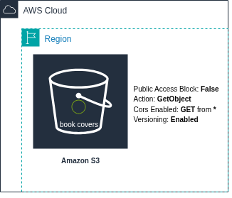
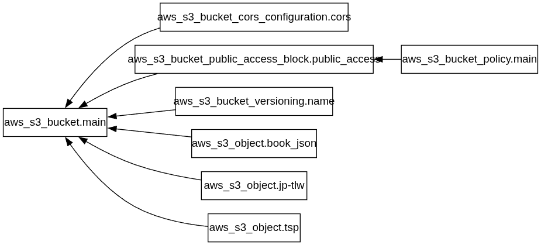

# Terraform S3 Book Covers

Create an S3 bucket to store book covers that will be fetched by JavaScript and displayed on a website.

## Project Architecture



## Terraform Graph



## Possible Improvements

1. The current method of uploading objects to the S3 bucket is inefficient because it requires manual configuration. Using a ``for_each`` loop would make the process more automated.
2. A better way of getting the image instead of fetching the json?

## Snyk IaC Test Report

```bash
  [Low] S3 bucket MFA delete control disabled
  [Low] S3 server access logging is disabled
  [High] S3 block public ACLs control is disabled
  [High] S3 block public policy control is disabled
  [High] S3 ignore public ACLs control is disabled
  [High] S3 restrict public bucket control is disabled
  ```
  